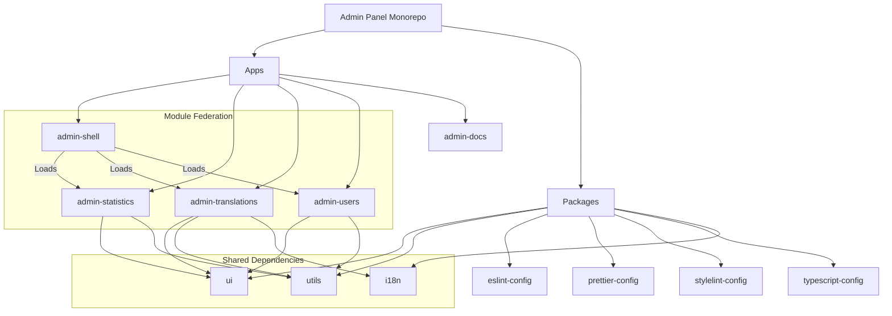
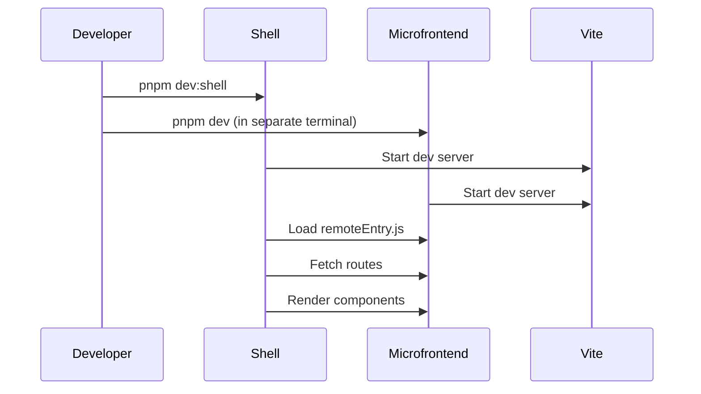
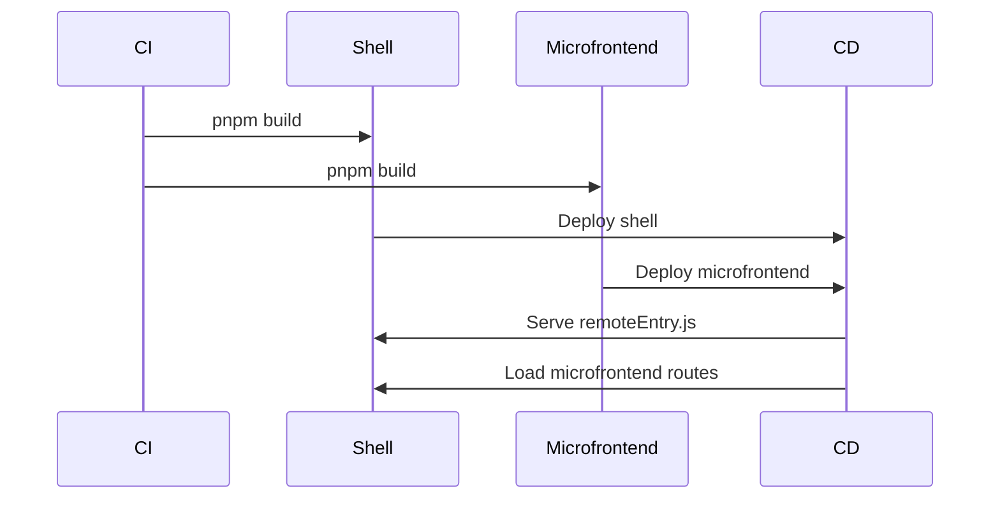
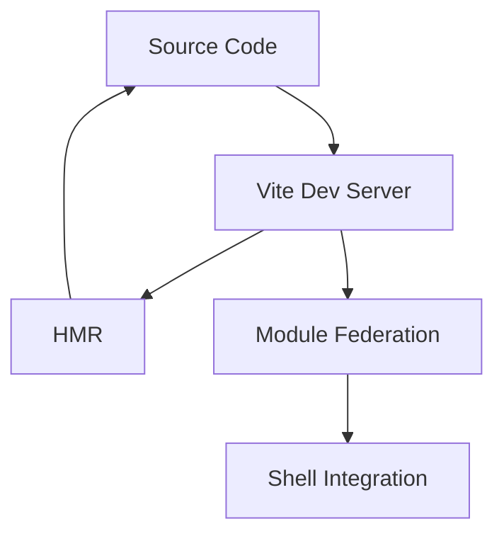
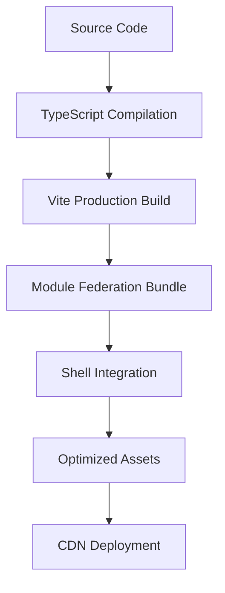
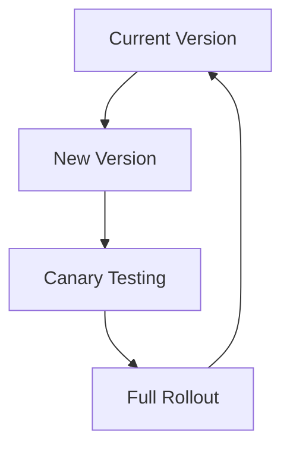

# Admin Panel Architecture

## Overview

This document describes the architecture of the Admin Panel monorepo, which uses a microfrontend approach with Vite + Module Federation.

## Architecture Diagram



## Core Concepts

### Microfrontends

Each microfrontend is an independent Vue 3 application that:

1. **Exposes routes** via Module Federation
2. **Consumes shared dependencies** from the packages directory
3. **Runs independently** in development mode
4. **Integrates** into the shell in production

### Module Federation Configuration

Each microfrontend has a `vite.config.ts` that defines:

```typescript
federation({
	name: 'microfrontend-name',
	filename: 'remoteEntry.js',
	exposes: {
		'./MicrofrontendRoutes': './src/app/router/index.ts',
	},
	shared: ['vue', 'vue-router'],
})
```

### Shell Application

The `admin-shell` application:

1. **Hosts** all microfrontends
2. **Loads routes dynamically** from remoteEntry.js files
3. **Provides shared layout** and navigation
4. **Manages authentication** and authorization

## Development Workflow

### Local Development



### Production Build



## Communication Patterns

### Route Exposure

Each microfrontend exposes its routes through a named export:

```typescript
// src/app/router/index.ts
const routes: RouteRecordRaw[] = [
	{
		path: '/statistics',
		component: () => import('#pages/IndexPage.vue'),
	},
]

export default routes
```

### Component Communication

Microfrontends communicate through:

1. **Props** - Parent components pass data to child components
2. **Events** - Child components emit events to parent components
3. **Shared State** - Using Vuex or Pinia for cross-microfrontend state
4. **Custom Events** - Using the `mit` library for event-based communication

## Build Pipeline

### Development Build



### Production Build



## Performance Optimization

### Caching Strategy

- **Vite**: Uses esbuild for fast bundling
- **Turborepo**: Caches build outputs and dependencies
- **Module Federation**: Caches remoteEntry.js files
- **Browser**: Uses service workers for offline support

### Build Optimization

- **Code Splitting**: Each microfrontend is a separate chunk
- **Tree Shaking**: Removes unused code
- **Lazy Loading**: Loads components on demand
- **Compression**: Uses Brotli compression for assets

## Monitoring and Analytics

### Error Tracking

- **Sentry**: Catches and reports errors
- **Log Rocket**: Records user sessions
- **New Relic**: Monitors performance

### Health Checks

Each microfrontend exposes:

- `/health` - Basic health check
- `/metrics` - Prometheus metrics
- `/ready` - Readiness probe

## Security Considerations

### Authentication

- **JWT**: JSON Web Tokens for authentication
- **OAuth**: Support for external providers
- **Session Management**: Secure cookie storage

### Authorization

- **Access Management**: Role-Based Access Control and Permissions
- **ABAC**: Attribute-Based Access Control
- **Policy Engine**: Centralized policy management

### Security Headers

- **CSP**: Content Security Policy
- **HSTS**: HTTP Strict Transport Security
- **XSS Protection**: Cross-Site Scripting protection

## Deployment Strategy

### Blue-Green Deployment



### Feature Flags

- **LaunchDarkly**: Feature flag management
- **Flagsmith**: Open-source alternative
- **Custom Implementation**: Using environment variables

## Troubleshooting

### Common Issues

1. **Module Federation Loading Errors**
   - Check network tab for failed remoteEntry.js requests
   - Verify CORS headers are set correctly
   - Ensure ports are not blocked

2. **HMR Not Working**
   - Restart Vite dev servers
   - Clear browser cache
   - Check for port conflicts

3. **Build Failures**
   - Run `pnpm lint` to check for code issues
   - Run `pnpm type-check` to check TypeScript errors
   - Check `pnpm outdated` for dependency issues

### Debugging Tools

- **Vite Inspector**: Debug Vite plugins
- **Module Federation Inspector**: Inspect remote modules
- **Chrome DevTools**: Debug performance issues
- **Vue DevTools**: Inspect Vue components

## Best Practices

### Code Organization

- **Feature-based**: Organize code by feature, not by type
- **Atomic Design**: Use atoms, molecules, organisms, templates, pages
- **Layered Architecture**: Separate concerns into layers

### Тестирование (Testing Strategy)

Мы придерживаемся стратегии «Пирамиды Тестирования»:

1. **Unit Tests (Основание)**:
   - **Frontend**: Vitest. Покрывают чистые функции и мелкие компоненты в `packages/lib` и `packages/ui`.
   - **Цель**: 80%+ покрытие логики.

2. **Integration Tests (Середина)**:
   - **Frontend**: Vitest + Vue Test Utils. Проверка рендеринга виджетов и страниц с моканием API.
   - **Backend**: Axum-test. Проверка эндпоинтов API с использованием `TestBearer` для обхода авторизации без обращения к БД.
   - **Скрипты**: `pnpm -C server test` (интеграционные тесты сервера).

3. **E2E Tests (Вершина)**:
   - **Инструменты**: Cypress / Playwright.
   - **Область**: Критические пути пользователя (Login, Dashboard navigation).
   - **Команды**: `pnpm test:e2e`.

#### Особенности реализации

- **Auth Bypass**: В интеграционных тестах сервера используется заголовок `Authorization: TestBearer`, который позволяет Middleware пропускать запросы для тестирования маршрутов.
- **Microfrontends**: Тесты МФ запускаются в изоляции, но используют общие конфигурации Vitest из `@admin-panel/lib/vite`.

### Documentation

- **Code Comments**: Explain complex logic
- **TypeScript**: Use types for better documentation
- **Storybook**: Document UI components
- **Architecture Diagrams**: Visualize system structure

## Future Improvements

1. **Performance**
   - Implement edge caching
   - Add service worker support
   - Optimize asset loading

2. **Developer Experience**
   - Add local development UI
   - Improve error messages
   - Add performance metrics

3. **Security**
   - Implement security headers
   - Add vulnerability scanning
   - Improve authentication flow

4. **Observability**
   - Add distributed tracing
   - Implement logging standards
   - Add alerting system

## Glossary

- **Microfrontend**: Independent application that can be developed and deployed separately
- **Module Federation**: Webpack/Vite plugin for sharing code between applications
- **Shell**: Host application that loads and integrates microfrontends
- **HMR**: Hot Module Replacement for fast development
- **CORS**: Cross-Origin Resource Sharing for secure resource access
- **Access Management**: Role-Based Access Control for authorization
- **JWT**: JSON Web Token for authentication
- **CSP**: Content Security Policy for security headers

```

Now let's create a CI/CD workflow file:
```
