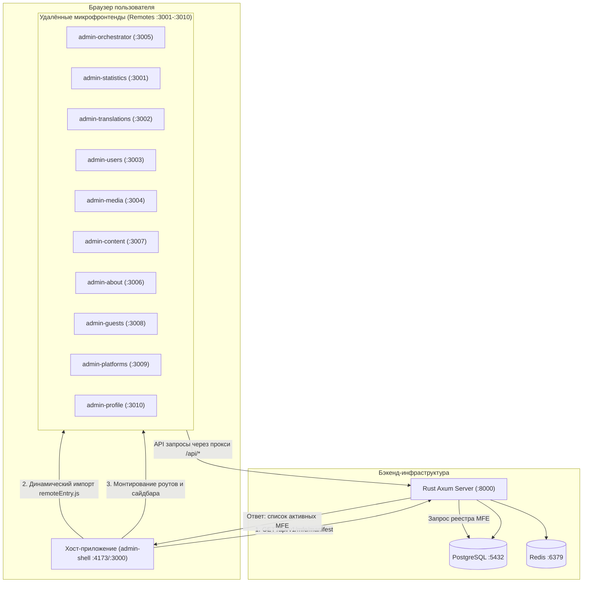
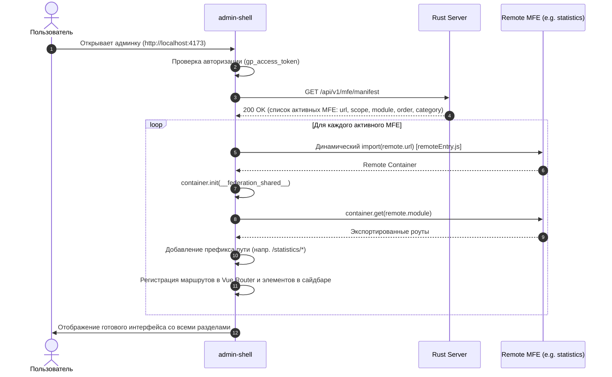

# Архитектура Admin Panel

## 1. Введение и общая картина

**Admin Panel** — это масштабируемая панель администрирования проекта **Guest Place**, построенная по принципу микрофронтендной архитектуры на базе **Vue 3**, **Vite**, **Module Federation** (`@originjs/vite-plugin-federation`) и **Turborepo**.

Вся экосистема **Guest Place** состоит из трёх ключевых узлов:
1. **`server`** — бэкенд на **Rust (Axum)**, использующий **PostgreSQL** для хранения данных и **Redis** для кэша и сессий. Предоставляет REST API (`/api/v1/*`), включая реестр микрофронтендов (`/api/v1/mfe/manifest`).
2. **`admin-panel`** — административная панель (данный репозиторий), объединяющая 11 бизнес-микрофронтендов под управлением хост-приложения `admin-shell`.
3. **`client`** — публичный сайт для гостей на **Nuxt 4**, взаимодействующий с бэкендом.

---

## 2. Диаграмма взаимодействия системы



---

## 3. Структура монорепозитория

Проект управляется через **pnpm workspaces** и оркестратор задач **Turborepo**.

```
admin-panel/
├── apps/                          # Приложения и микрофронтенды
│   ├── admin-shell/               # Хост-приложение: ядро, авторизация, сайдбар, динамический загрузчик MFE
│   ├── admin-orchestrator/        # Оркестратор: реестр MFE, статусы, конфигурация модулей
│   ├── admin-statistics/          # Статистика: аналитика, воронки, когорты, графики посещаемости
│   ├── admin-translations/        # Переводы: управление ключами i18n, неймспейсы, версии
│   ├── admin-users/               # Пользователи: список пользователей, RBAC (роли и права)
│   ├── admin-media/               # Медиатека: загрузка, кроп, оптимизация, привязка файлов
│   ├── admin-content/             # Headless CMS: конструктор схем (singletons/collections), записи, ревизии
│   ├── admin-about/               # О проекте: визуальные гайды, информационные страницы
│   ├── admin-guests/              # Гости: база гостей, гостевые возможности, ссылки
│   ├── admin-platforms/           # Платформы: внешние платформы и интеграции
│   ├── admin-profile/             # Профиль: настройки учётной записи администратора, безопасность
│   └── admin-docs/                # Storybook: документация компонентов дизайн-системы
│
├── packages/                      # Общие разделяемые библиотеки и конфигурации
│   ├── ui/                        # Единый UI-Kit (@admin-panel/ui): кнопки, инпуты, таблицы, модалки
│   ├── lib/                       # Базовая библиотека (@admin-panel/lib): API-клиент, события, роутинг, Vite-хэлперы
│   ├── i18n/                      # Пакет локализации (@admin-panel/i18n): словари и утилиты
│   ├── testing-utils/             # Утилиты для тестирования (моки, хелперы Vitest)
│   ├── eslint-config/             # Единый конфиг ESLint
│   ├── prettier-config/           # Единый конфиг Prettier
│   ├── stylelint-config/          # Единый конфиг Stylelint
│   └── typescript-config/         # Базовые конфигурации tsconfig
│
├── scripts/                       # Вспомогательные скрипты разработки
│   ├── choose-project.js          # Интерактивное меню выбора запуска приложений
│   ├── check-bundle-size.mjs      # Анализ размеров бандлов
│   └── create-mf/                 # Генератор шаблона нового микрофронтенда
│
├── pnpm-workspace.yaml            # Декларация пакетов монорепозитория
└── turbo.json                     # Конфигурация конвейера задач Turborepo
```

---

## 4. Принципы работы микрофронтендов (Module Federation)

### 4.1. Динамический манифест (Dynamic Remote Resolution)

В отличие от статического указания `remotes` в конфиге сборщика, в данном проекте адреса микрофронтендов определяются динамически во время выполнения:



### 4.2. Конфигурация Vite (`@admin-panel/lib/vite`)

Все микрофронтенды создаются через фабрику `createConfig` из пакета `@admin-panel/lib/vite`. Это гарантирует строгую единообразность:

- **Автоматическое назначение портов** из константы `APPS_PORTS`.
- **Настройка проксирования API**: все запросы к `/api/*` автоматически перенаправляются на адрес бэкенда (`http://localhost:8000` по умолчанию или из `VITE_API_BASE`).
- **Сжатие Gzip**: предкомпрессия статики через `vite-plugin-compression`.
- **Анализ размера бандлов**: генерация отчёта `stats.html` через `rollup-plugin-visualizer`.

### 4.3. Оптимизация стилей (`gp-css-externalizer`)

Одной из главных проблем Module Federation является дублирование тяжелых глобальных стилей (таких как стили `element-plus` и базовые сбросы) в каждом отдельном бандле микрофронтенда.

В проекте реализован плагин `gp-css-externalizer`:
- Когда микрофронтенд собирается для работы внутри хоста (`admin-shell`), плагин заменяет импорты глобальных CSS библиотек на пустой виртуальный модуль `\0virtual:gp-empty.css`.
- Все глобальные стили и токены единожды загружаются и применяются хост-приложением `admin-shell`.
- В автономном dev-режиме микрофронтенда (`isStandalone`) стили подгружаются полностью для независимой работы.

### 4.4. Разделяемые зависимости (Shared Singletons)

Чтобы избежать многократной загрузки библиотек в память браузера и поломки контекстов реактивности, следующие зависимости объявлены синглтонами:
- `vue`
- `vue-router`
- `pinia`
- `element-plus`
- `@tanstack/vue-query`
- `@admin-panel/ui`
- `@admin-panel/lib`
- `@admin-panel/i18n`

---

## 5. Потоки данных и коммуникация

### 5.1. Шина событий (`useEvents` & `GP_EVENTS`)

Для слабой связанности (loose coupling) между микрофронтендами используется типизированная шина событий:

```typescript
import { useEvents, GP_EVENTS } from '@admin-panel/lib'

const { dispatch, on } = useEvents()

// Отправка события обновления данных
dispatch(GP_EVENTS.UPDATED, { entity: 'translations' })

// Подписка на системные события
on(GP_EVENTS.UNAUTHORIZED, () => {
    // Реакция на истечение сессии
})
```

### 5.2. Общее состояние Pinia (`registerSharedStore` / `getSharedStore`)

Для случаев, когда требуется общий реактивный стейт между микрофронтендами, используется реестр разделяемых хранилищ Pinia, изолированный от конфликтов имён.

### 5.3. Сетевой слой и API-клиент (`createApi`)

Сетевое взаимодействие реализовано на базе библиотеки `ofetch` с автоматической нормализацией данных:
- **Автоматическая конвертация форматов**:
  - Данные, отправляемые на сервер, преобразуются из `camelCase` (JS-стиль) в `snake_case` (Rust/PostgreSQL стиль).
  - Данные, получаемые с сервера, преобразуются обратно из `snake_case` в `camelCase`.
- **Авторизация**:
  - Токен извлекается из `localStorage.getItem('gp_access_token')` и подставляется в заголовок `Authorization: Bearer <token>`.
- **Обработка 401/403**:
  - При ошибке авторизации токены очищаются, диспатчится событие `GP_EVENTS.UNAUTHORIZED`, и пользователь перенаправляется на `/login`.

---

## 6. Безопасность и авторизация

1. **Аутентификация по JWT**:
   - Токены доступа (`access_token`) с коротким временем жизни и токены обновления (`refresh_token`).
   - Маршруты бэкенда защищены middleware проверки JWT.
2. **RBAC (Role-Based Access Control)**:
   - Модель прав: роли (`SuperAdmin`, `Admin`, `Editor`, `Viewer`) и матрица гранулярных разрешений (`permissions`).
   - Сайдбар и роутер хоста фильтруют доступные разделы в соответствии с правами пользователя.
3. **Навигационные гарды (Router Guards)**:
   - Проверка наличия токена перед каждым переходом по маршрутам. Публичные маршруты (например, `/login`) помечаются флагом `meta: { public: true }`.

---

## 7. Стратегия тестирования

Проект следует классической пирамиде тестирования:

1. **Unit-тесты (Vitest)**:
   - Проверка чистых функций, утилит форматирования, валидаторов и хуков в `packages/lib` и `packages/ui`.
   - Запуск: `pnpm test:unit`
2. **Интеграционные тесты (Vitest + Vue Test Utils)**:
   - Тестирование компонентов, виджетов и страниц с мокированием API-ответов.
   - Изолированное тестирование маршрутизации отдельных микрофронтендов.
3. **Интеграционные тесты бэкенда (Axum-test)**:
   - Проверка контрактов эндпоинтов на стороне Rust с обходом авторизации через `Authorization: TestBearer`.
4. **E2E-тесты (Cypress)**:
   - Проверка критических сценариев в реальном браузере: вход в систему, переключение между микрофронтендами, создание и редактирование контента.
