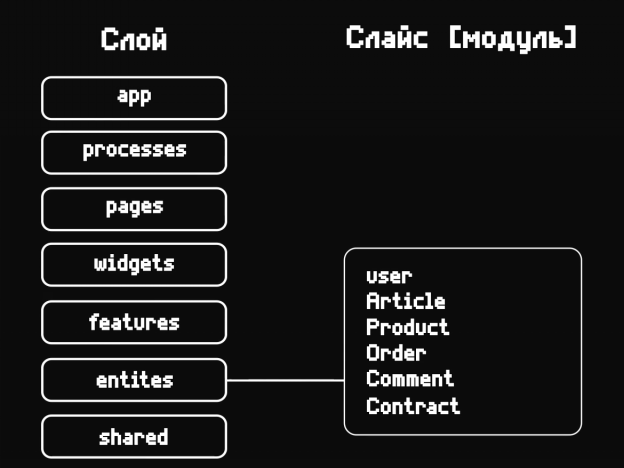
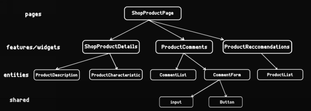

# Feature Sliced Design (FSD)

## Оглавление

- [Что такое FSD](ARCHITECTURE.md#что-такое-FSD)
- [Немного о мотивации FSD](ARCHITECTURE.md#немного-о-мотивации-fsd)
- [Что из себя представляет FSD](ARCHITECTURE.md#что-из-себя-представляет-fsd)
  - [Слой](ARCHITECTURE.md#слой)
  - [Слайс](ARCHITECTURE.md#слайс)
  - [Сегмент](ARCHITECTURE.md#сегмент)
- [Преимущества](ARCHITECTURE.md#преимущества)
- [Как определить, к какому слою относится слайс](ARCHITECTURE.md#как-определить-к-какому-слою-относится-слайс)
- [ВАЖНО](ARCHITECTURE.md#важно)
- [Структура проекта](ARCHITECTURE.md#структура-проекта)
- [Подробнее про FSD](ARCHITECTURE.md#подробнее-про-fsd)

## Что такое FSD

**FSD** - это архитектурная методология построения интерфейсных приложений, которая представляет собой сборник правил и соглшений по организации кода.

**Цель данной методологии** - сделать проект более понятным и структурированным перед лицом постоянно меняющихся требований бизнеса.

## Немного о мотивации FSD

Основная идея заключается в облегчении и удешевлении разработки сложных проектов. Конечно, уже существуют устоявшиеся подходы и принципы проектирования, такие как _SOLID_, _KISS_, _YAGNI_, _DRY_ и т.д., но одних только принципов для создания хорошей архиеткутры недостаточно. Также этм принципы слишком общие и не дают ответа на вопрос о том, как спроектировать структуру и архитектуру масштабируемого и гибкого приложения.

## Что из себя представляет FSD

Разберем понятия, которые существуют в FSD.

### Слой

Слои представляют собой бизнес ориентированные части приложения со своей зоной ответственности, которые позволяют разделить проект на ступенчатую иерархию, т.е. нижележащие слои не могут содержать в себе вышележащие, либо комбинируют их. Количество слоев всего 7, но некоторые из них могут быть опциональными:

- `app` - входная точка в приложение. Здесь хранятся необходимые провайдеры, глобальные стили и лайауты. Иными словами, здесь расположена инициализирующая логика приложения.
- `pages` - содержит в себе комбинации _widgets_ и _features_. Страница должна оставаться максимально тонкой без лишней бищнес логики. В идеале, страница - это перечисление widgets и features, обернутых в какой нибудь лайаут.
- `widgets` - самостоятельные смысловые блоки, которые комбинируют нижележащие слои (_features_ и _entities_). Фичи вставляются в сущности при помощи слотов. Например, пост (_entities_) с возможностью оставить комментарий или поставить лайк (_features_).
- `features` - части функциональности, несущие бизнес-ценность (поставить лайк, подписаться, сменить язык). Один модуль фичи должен отвечать за одну функциональность.
- `entities` - бизнес сущности (пост, статья, комментарий, заказ, карточка товара). Это своего рода шаблоны (лайауты) для создания самостоятельных компонентов со своей логикой (лайауты бизнес-сущностей).
- `shared` - содержит в себе максимально переиспользуемые компоненты системы, не содержащие внутри себя никакой бизнес-логики (например, UI-компоненты).

Ниже представлена таблица, которая отражает возможность использования одного слоя внутри себя других слоев.

| Layer | Can use | Can be used by |
| :-: | :-: | :-: |
| _app_ | `shared`, `entities`, `features`, `widgets`, `pages`, `processes` | - |
| _processes_ | `shared`, `entities`, `features`, `widgets`, `pages` | `app` |
| _pages_ | `shared`, `entities`, `features`, `widgets` | `processes`, `app` |
| _widgets_ | `shared`, `entities`, `features` | `pages`, `processes`, `app` |
| _features_ | `shared`, `entities` | `widgets`, `pages`, `processes`, `app` |
| _entities_ | `shared` | `features`, `widgets`, `pages`, `processes`, `app` |
| _shared_ | `shared`<br/>_Существуют кейсы, когда необходимо при создании одного UI компонента использовать другой, но никакой слой под такие кейсы не подходит. Поэтому разрешается взаимодействие компонентов shared друг с другом._ | `entities`, `features`, `widgets`, `pages`, `processes`, `app` |

### Слайс

Каждый слой содержит в себе слайсы. Слайс - это модуль, который отвечает за конкретный компонент и привязанный к нему функционал. Примеры:

- **entities**: _product_, _order_, _user_, _comment_
- **features**: _PhoneForm_, _ContactForm_
- **widgets**: _TheSidebar_, _TheHeader_, _PostCard_





### Сегмент

Каждый слайс содержит в себе сегменты. Сегменты являются отдельными частями, которые предоставляют необходиммые элементы для создания слайса и наделения его нужным функционалом. Это могут функции, типы, компоненты и т.д. Пример сегмента для слайса какого-либо слоя:

- **_ui_** - компоненты пользовательского интерфейса.
- **_lib_** - используется для размещения универсальных, переиспользуемых утилит и библиотек
  - Хелперы/утилиты, обёртки над сторонними библиотеками, Инструменти для логгирования, трассировки и т.д
- **_api_** - функции для работы с api.
- **_constants_** - константы, которые используются в слайсе

## Преимущества

- Компоненты архитектуры можно гибко заменять или добавлять под новые условия.
- Контролируемые и явные связи между модулями без неожиданных сайд-эффектов.
- Не зависит от технического стека.
- Масштабируемость архитектуры и команды разработки.
- Каждый модуль может быть независимо модифицирован без побочных эффектов.

## Как определить, к какому слою относится слайс

Перед началом разработки модуля необходимо определить, к какому слою он относится. Ниже представлен список вопросов, которые помогут определить принадлежность модуля к какому-либо слою.

- `app` - Это общая инициализирующая логика приложения?
- `pages` - Это относится к конкретной странице/экрану?
- `widgets` - Это самостоятельный и полноценный блок страницы с конкретными действиями?
- `features` - Это относится к действию пользователя, представляющему бизнес-ценность?
- `entities` - Это относится непосредственно к бизнес-сущности?
- `shared` - Это не относится к бизнес логике и является общим переиспользуемым компонентом?

## ВАЖНО

1. Слои предназначены для группировки нижележащих слоев.
2. К слоям следует относиться как к зонам ответственности.
3. Слои позволяют сделать поток данных однонаправленным и избежать неявных связей между модулями.
4. Каждый модуль должен предоставлять публичное API (при помощи **export** в **index.ts** файле), передавая вышележащим модулям в вышележащих слоях только необходимые компоненты.
5. При построении FSD архитектуры необходимо сразу думать о проектировании и декомпозировании модуля перед его созданием.
6. Если при определении принадлежности модуля какому-либо слою, лежащему ниже слоя _widgets_, возникает неопределенность, то такой компонент лучше определить как внутренний компонент виджета (если этот компонент не используется в других модулях).

## Структура проекта

- Для именования модулей и компонентов использовать 2 и более слов (включая префикс). Префикс должен быть первой буквой имени слоя, в котором находится модуль. Пример: `user-card`(_entity_).
- Компоненты, экспортируемые из модулей, именовать в соответствии с именованием модуля. Для остальных компонентов в модуле префикс необязателен. Пример: `user-card.vue` (_entity_).
- Директории именуются в стиле `camelCase` за исключением имен модулей. Модули именуюся в стиле `cebab-case`. Пример: `entities/user-card/api.`
- Каждый модуль должен содержать сегменты, которые относятся только к этому модулю. Наличие каждого сегмента опционально в зависимости от требований. Ограничений по количеству сегментов нет. Пример содержания модуля:

  ```bash
  > api - Функции для работы с API
      user.ts
      index.ts
  > ui - Vue компоненты, которые относятся непосредственно к модулю
      UserCard.vue
  > constants - Константы
      user.ts
      index.ts
  > utils - функции-помощники для работы с данными
      userCard.ts
      index.ts
  > composables - Хранилища
      useUser.ts
      index.ts
  > types - Типы
      user.ts
      index.ts
    index.ts - Публичное API модуля
  ```

- Каждый модуль должен содержать файл **index.ts**, который отвечает за экспорт необходимых компонентов и других его состовляющих из модуля. Пример:

  ```javascript
  // entities/user-card/index.ts

  export { default as UserCard } from '@/entities/user-card/ui/UserCard.vue'
  ```

  ```javascript
  // widgets/user-card/ui/UserCard.vue

  <template>
    <UserCard>
        <template #remove>
            <RemoveUser />
        </template>
    </UserCard>
  </template>

  <script lang="ts" setup>
    import { FRemoveUser } from '@/features/remove-user'
    import { UserCard } from '@/entities/user-card'
  </script>
  ```

### Пример структуры

```bash
> app
  > layouts - Шаблоны для вставки страниц
      MainLayout.vue
  > providers - Провайдеры
  > router - Конфигурация vue-router
      index.ts
  > styles - Глобальные стили, переменные, миксины и т.д.
      > resources
      > vendor
        index.scss
    index.ts
> pages
  > ProfilePage - Страница профиля
    > api
    > ui
     - ProfilePage.vue
    > components
    > constants
    > utils
    > composables
    > types
      index.ts
> widgets
  > UserCard - Карточка пользователя, самостоятельный компонент приложения
    > api
    > components
    > ui
     - UserCard.vue
    > constants
    > utils
    > composables
    > types
      index.ts
> features
  > ChangeProfileImage - Модуль, отвечающий за смену картинки профиля
    > api
    > components
    > ui
     - ChangeProfileImage.vue
    > constants
    > utils
    > composables
    > types
      index.ts
> entities
  > user-card - Шаблон карточки пользователя
    > api
    > components
    > ui
     - UserCard.vue
    > constants
    > utils
    > composables
    > types
      index.ts
> shared
  > api
      auth.ts
      index.ts
  > ui
    > ui-button
     > ui
        UiButton.vue
      index.ts
    > ui-upload
     > ui
        UiUpload.vue
    index.ts
  > types
      user.ts
      index.ts
  > composables
    > auth
        useAuth.ts
        index.ts
```

## Подробнее про FSD

- [Руководство](https://feature-sliced.design/docs/get-started/tutorial)
- [О целях и мотивации FSD](https://feature-sliced.design/docs/about)
- [Гайды](https://feature-sliced.design/docs/guides)
- Разбор некоторых кейсов:
  - [Авторизация](https://feature-sliced.design/docs/guides/examples/auth)
  - [Page layout](https://feature-sliced.design/docs/guides/examples/page-layout)
- Примеры:
  - [Vue](https://github.com/EliseyMartynov/fs-vue/tree/master/src)
  - [React](https://github.com/EliseyMartynov/fs-rtk)

Также можно посмотреть видеоролик на YouTube. Таймкод 27:00.

[Смотреть](https://www.youtube.com/watch?v=c3JGBdxfYcU)
